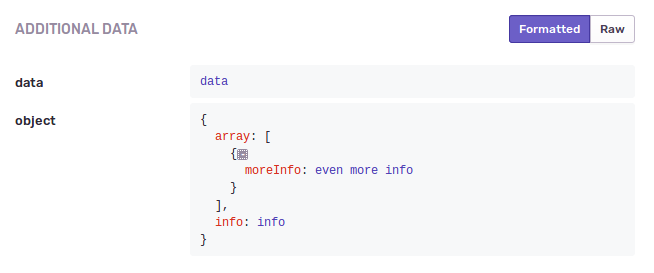
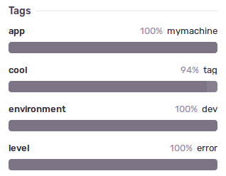
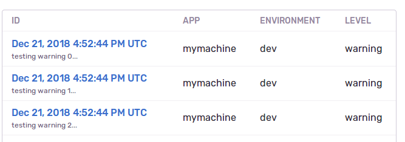

# node-logger

Winston logger with sentry configuration included. Also show the file from which the log originated.

## Table of contents

* [Environment Variables](#environment-Variablss)
  * [Mandatory](#mandatory)
  * [Optional](#optional)
* [Default Behaviours](#default-behaviours)
* [Setting up](#setting-up)
* [Usage](#usage)
  * [Info and Warning](#info-and-Warning)
  * [Error](#error)
* [Metadata and other options](#metadata-and-other-options)
  * [Extra](#extra)
  * [Tags](#tags)
  * [Fingerprint](#fingerprint)
* [Examples](#examples)

## Environment Variables

### Mandatory

Sentry logging won't start if these values are not defined.

|        Name          |                 Description                       |
| -------------------- | ------------------------------------------------- |
| SENTRY_DSN           | Sentry's DNS                                      |
| SENTRY_APP           | The application's name                            |
| SENTRY_ENVIRONMENT   | The environment running (dev, staging, prod, etc) |


### Optional

|        Name          |                 Description                  |
| -------------------- | -------------------------------------------- |
| SENTRY_RELEASE       | The current application release (defaults to None) |
| CONSOLE_LOG_LEVEL    | The level of the logs displayed on the console (defaults to info and up) |
| SENTRY_LOG_LEVEL     | The level of the logs submitted to Sentry (defaults to warn and up) |

## Default Behaviours

By default the configuration of this lib will:
* Log uncaught errors.
* Log uncaught promise rejections.

Without the need of any additional configuration/options.

## Setting up

```sh
npm install --save git+https://github.com/quintoandar/node-logger.git#<latest-release-version>
```

Or add it on your `package.json` file like:

```sh
"dependencies": {
  "quintoandar-logger": "git+https://github.com/quintoandar/node-logger.git#<latest-release-version>",
},
```

[See releases](https://github.com/quintoandar/node-logger/releases)

## Usage

### Info and Warning

With info and warning messages the behaviour is the same. You are able to send the string (the info message) plus any other metadata you want as the second parameter.
```js
const logger = require('quintoandar-logger').getLogger(module);

const object = { id: 11, someInfo: 'someInfo' }
logger.info(`Some info about processing cool object with id ${object.id}`, { extra: { data: object } });
logger.warn(`Some warning about processing cool object with id ${object.id}`, { extra: { data: object } });
```

On the console it will be logged as a json:
```sh
{"level":"info","message":"Some info about processing cool object with id 10","extra_data":{"extra":{"data":{"id":"11","someInfo":"someInfo"}}},"logger_name":"path/to/my/file.js","timestamp":"2018-12-19T18:15:57.078Z"}
```

### Error

With error messages, while really similar to both info and warning, there are some small differences. You are able to log error messages using a string, like the previous examples:
```js
const logger = require('quintoandar-logger').getLogger(module);

const object = { id: 11, someInfo: 'someInfo' }
logger.error(`Some error about processing cool object with id ${object.id}`, { extra: { data: object } });
```

And on the console you will have:
```sh
{"level":"error","message":"Some error about processing cool object with id 10","extra_data":{"extra":{"data":{"id":"11","someInfo":"someInfo"}}},"logger_name":"path/to/my/file.js","timestamp":"2018-12-19T18:15:57.078Z"}
```

However keep in mind that when this information is sent to Sentry, you will not be able to see any stacktrace and code snipets. Sentry is only able to show that information with an object of type `Error`. So the best way to log an error would be:
```js
const logger = require('quintoandar-logger').getLogger(module);

const object = { id: 11, someInfo: 'someInfo' }
try {
  functionThatWillThrowAnError(object);
} catch (error) {
  logger.error(error, {
    extra: {
      message:`Some error about processing cool object with id ${object.id}`,
      data: object
    }
  });
}
```

========================

CHECK THIS ^

should it really be happening? logger.error(string) should still show stacktrace and code snipets, shouldn't it?

========================


## Metadata and other options

As mentioned before, when logging something the second argument can be any sort of "metadata", however there are some specific keys that have helpful behaviours you should be aware of.

### Extra

When the second argument is an object with a key `extra`, all the information inside of it will be displayed on Sentry under "Additional Data". For exmaple:
```js
const logger = require('quintoandar-logger').getLogger(module);

logger.error(new Error('testing real error'),
  { extra: { data: 'data', object: { info: 'info', array: [{ moreInfo: 'even more info' }] } } );
```

On Sentry you will see:



### Tags

Some times you might want to send some specific tag with your logs, so you can also further filter all your logs based on it. This is possible with the key `tags`:

```js
const logger = require('quintoandar-logger').getLogger(module);

logger.error('testing error...', { tags: { cool: 'tag' }, extra: { data: 'data' } });
```

On Sentry you will see:



The tag `app` is created by default by using the `SENTRY_APP` environment variable.

### Fingerprint

Sentry always group logs by the message. However some times, even if the messages are different, you do want all the logs to be grouped together. This can be achieved by using the key `fingerprint`:
```js
const logger = require('quintoandar-logger').getLogger(module);

for (let i = 0; i < 3; i += 1) {
  logger.warn(`testing warning ${i}...`, { fingerprint: ['somefingerprint'], extra: { data: 'data' } });
}
```

With this, all logs `testing warning 0...`, `testing warning 1...`, ,`testing warning 2...`, will be grouped in Sentry. You will see the events on the same log:



## Examples

You can check more examples [here](./example).